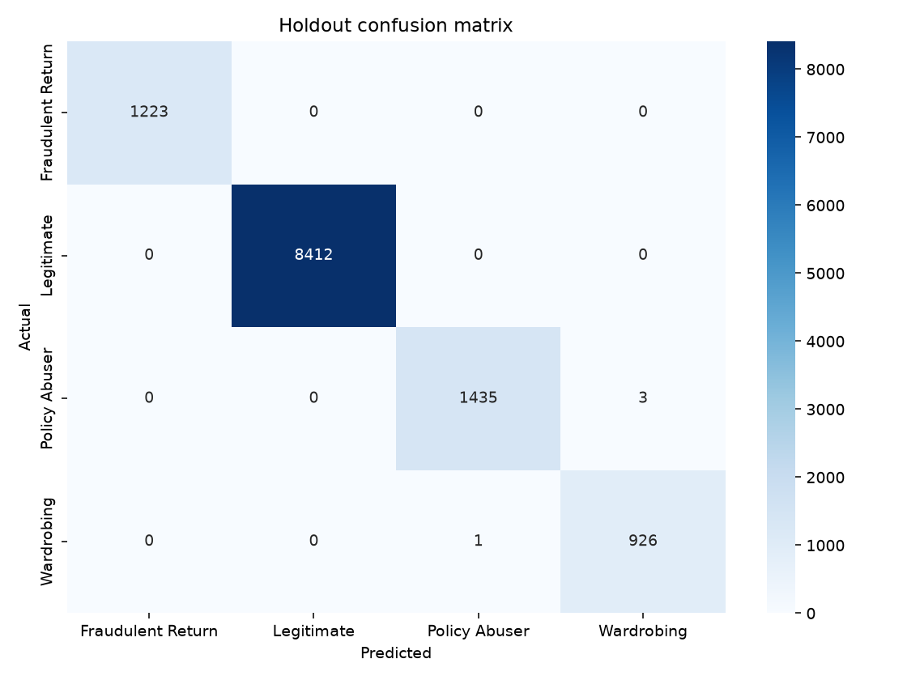

# Return-Risk Scorer & Auto-Responder

Defense-only **AI Risk Manager** for the Razorpay AI Buildathon.

Scores e-commerce return requests for abuse risk, explains the decision, takes a **bounded** action (`auto_approve` / `hold_for_evidence` / `escalate_to_human`), and writes a full audit trail. Never auto-denies or blocks accounts.

## Architecture

```
Return request
    → Detector (LightGBM multiclass + SHAP reason codes)
    → Verifier (cost-weighted policy thresholds)
    → Auto-Responder (Gemini preferred / OpenAI fallback: case note + customer message)
    → Audit Trail (JSONL + SQLite)
```

**Failure case handled explicitly:** incomplete/contradictory inputs → `insufficient_signal` → manual review (no forced guess).

## Dataset

[E-Commerce Return Abuse Detection Dataset](https://www.kaggle.com/datasets/sarveshchhetri/e-commerce-return-abuse-detection-dataset) (60k rows, 35 features).

Place CSV at:

`data/raw/ecommerce_return_abuse_dataset.csv`

Classes: `Legitimate`, `Policy Abuser`, `Fraudulent Return`, `Wardrobing`.

> Note: this Kaggle set is highly separable (holdout macro-F1 ≈ 0.999). We still report honest held-out metrics and put differentiation in the **policy + FP cost + audit + failure path**, not inflated accuracy claims.

## Setup

```bash
# Use the project venv (required on Windows if LibreOffice python is first on PATH)
python -m venv .venv
.\.venv\Scripts\activate
pip install -r requirements.txt
copy .env.example .env
# Edit .env — must be: OPENAI_API_KEY=sk-...
```

## One-command reproduce

```bash
.\.venv\Scripts\python.exe scripts\train.py
.\.venv\Scripts\python.exe scripts\evaluate.py
.\.venv\Scripts\python.exe scripts\run_demo.py
```

Optional dashboard:

```bash
streamlit run app/streamlit_app.py
```

## What each script does

| Script | Purpose |
|---|---|
| `scripts/train.py` | EDA, stratified 80/20 split, train LightGBM, save model + policy table |
| `scripts/evaluate.py` | Holdout P/R/F1, confusion matrix, FP cost, batch audit (≥50) |
| `scripts/run_demo.py` | 2–3 live examples including `insufficient_signal` |

## Decision policy

| Band | Action | Notes |
|---|---|---|
| Low risk | `auto_approve` | Fast path for clear legitimate returns |
| Medium | `hold_for_evidence` | Auto-responder asks for photos/packaging proof |
| High | `escalate_to_human` | Still never auto-denied |
| Insufficient signal | `insufficient_signal` | Manual review |

Thresholds are tuned against an explicit **false-positive cost scaled by `refund_amount_requested_usd`** (FN ≈ full refund at stake; FP hold/escalate = rate × refund). See `outputs/metrics/policy_table.json` after training.

## Held-out metrics

After `scripts/evaluate.py`, the holdout confusion matrix is written to `outputs/plots/confusion_matrix.png`:



Macro F1 on this synthetic set is ≈ 0.999 — report it honestly; see the dataset note above and Known limitations below.

## Compliance

- Strictly defense-only
- No account suspension / payment blocking / auto-denial
- Every automated decision is human-reversible
- Metrics reported on a true held-out split

## Known limitations (live deployment)

- Validated on a static synthetic Kaggle dataset, not live merchant return traffic.
- Features such as `return_rate_pct`, `total_returns_lifetime`, and `category_abuse_rate` are precomputed aggregates; production would need a real-time feature store.
- There is no model-side out-of-distribution detector beyond the Streamlit manual-entry input caps (training 99th percentiles).
- Cold-start customers with little or no history remain a blind spot for behavioral signals.
- Ground-truth abuse labels arrive late (after investigation), so live retraining cannot be immediate.

## Project layout

```
src/detector/   # model + SHAP
src/verifier/   # policy + insufficient-signal gate
src/agent/      # Gemini/OpenAI auto-responder
src/audit/      # JSONL/SQLite logger
src/pipeline.py # end-to-end
app/            # Streamlit UI
scripts/        # train / evaluate / demo
tests/          # pytest leakage / cost / failure-path checks
```
